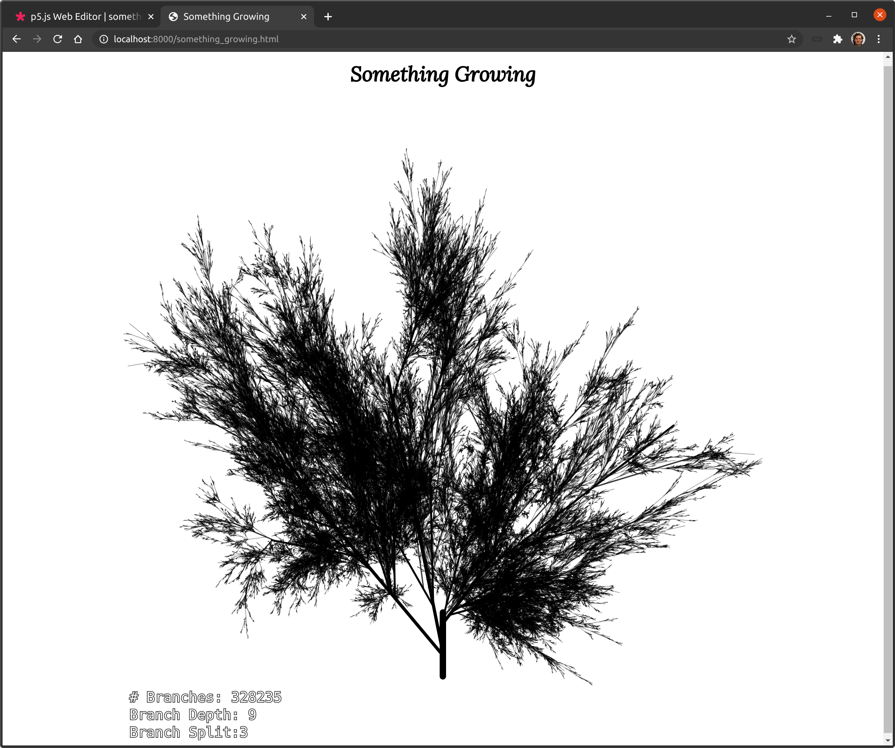

# creative-encodings
Random creative coding stuff like p5js that are too big for the sandbox ...

## Something_Growing

My first real attempt at building something organic and procedural (is there anything non-procedural organic possible?) with p5js. It generates a branch and recursively splits the branch up into several other branches with certain ranges for direction and thickness and so on that directs the growth somewhat. It terminates after a max number of branches is reached or whenever the max depth or so is reached. Branches that grow outside of the bounds are ignored. Please note that the number of branches may slighly exceed the num branches for whatever reason, but it stays within close proximity of the upper bound.

